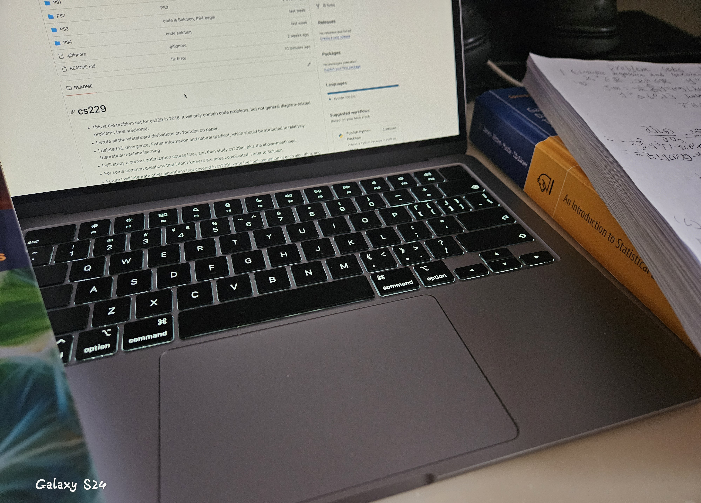

# Stanford cs229

- This is the problem set for cs229 in 2018. This repository contains some of my process of learning machine learning
- The coding questions in cs229 were not very good, and I skipped most of them(I studied other relatively practical tutorials).
- I wrote down all the whiteboard derivations from the Youtube lectures and the steps of some important exercises on paper.

- I deleted KL divergence, Fisher information and natural gradient, which should be attributed to relatively theoretical machine learning.
- If I have time to delve deeper into AI, I will first take a convex optimization course, then cs229m, and then add the above content.
- For some common problems that I didn’t know or were more complicated, I referred to the solutions and then repeated them with the book covered.
- Future I will integrate other algorithms (not covered in cs229), write the implementation of each algorithm, and then I will upload it to my ML-notes.
- If you need to view _sol.md, please download vscode and install it, or Obsidian.
